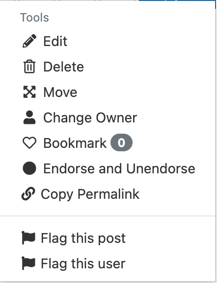

# User Guide

## Overview

Since students can ask questions at any time, it can be hard for instructors to answer all questions in a timely manner. It may be more efficient for other students to provide an answer, instead. Although this is sufficient for most situations, how would posters know if student answers are accurate, especially for difficult concepts?

NodeBB's new endorse feature solves this problem by allowing instructors to endorse posts. If instructors find that student posts contain helpful information that would benefit others, they can endorse the post so that other students know that the answer is reliable.

Aside from reassuring students that information is correct, endorsing posts has an additional side effect of encouraging students to answer questions more often. Overall, endorsing posts would allow students to work more efficiently and create a collaborative environment.

## Set Up

To get started, first navigate to your local directory and pull these changes or make a copy of this code with the following:

```
% git clone https://github.com/CMU-313/spring23-nodebb-team-florida.git
```

Navigate into the newly created local repository

```
% cd spring23-nodebb-team-florida
```

If this is the first time you are working with NodeBB, follow the instructions available [here](https://cmu-313.github.io/projects/P1/#getting-started) on the course page.

Then, run the following in your terminal to build and run NodeBB:

```
% ./nodebb build
% ./nodebb start
```

With the platform now running, create accounts for two different users. Sign in to these accounts on two different browsers.

Create some posts with each account to populate the site if there are no current posts available.

## How to Use

### User 1

Navigate to any post on the platform and open the Post Menu indicated by the three vertical dots button in the bottom right of each post.

Once expanded, you should see a newly added button labeled "Endorse and Unendorse". Note that, at the current stage, all account types (instructors, admin, student) will have access to this button and the endorse functionality for the ease of demostration and testing.

When a post is currently unendorsed, the post will have no prompts, and the menu will appear as below:


When a post is currently endorsed, the icon will change to a checkmark as below immediately, and a green text saying ""xxx-user" is endorsed" will appear at the bottom of this post (please refresh to reflect this change):


### User 2

Using the other account, refresh the page to load these changes. When the Post Menu is reopened, you should see that the icon matches the endorse status that was set by User 1, and that the post will have the green text saying this post has been endorsed by the user. This gives a clear visual sign to the user that the post has been endorsed.

## Testing

Automated tests on the API endpoint have been added to `test/posts.js` found [here](https://github.com/CMU-313/spring23-nodebb-team-florida/blob/main/test/posts.js) in the repository.

In test/posts.js, we are testing whether the endorse button will endorse a post that has not been endorsed yet and whther the endorse button will unendorse a post that is already endorsed. This is tested through two different functions with the labels "should endorse a post" and "should unendorse a post."

These two tests are sufficient because these are the two possible things that the endorse button can accomplish. The functions just check whether the hasEndorsed constant is true or false in order to determine whether the post has been endorsed or not.
